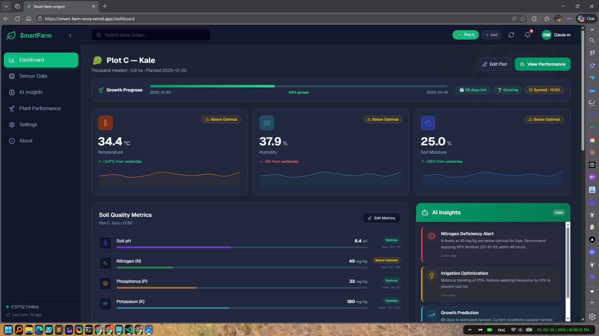
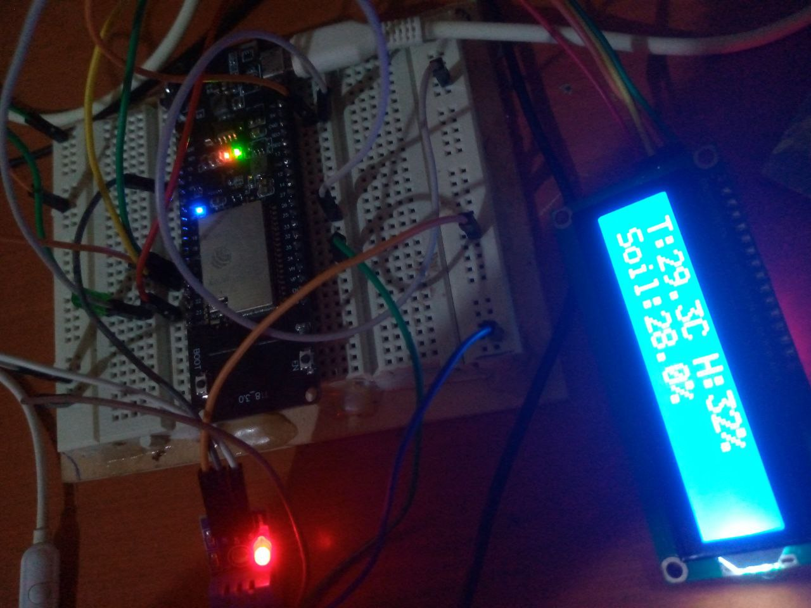

# Smart Farm - IoT Agricultural Monitoring System

A web-based IoT platform that collects real-time sensor data and delivers AI-powered insights to help farmers optimize crop health and yield.

## 🌾 Project Overview

Smart Farm connects ESP32-based IoT sensors to a responsive web dashboard, enabling remote monitoring of soil and environmental conditions in real-time.

### Key Features

- **Real-time Sensor Monitoring**: Simultaneous tracking of multiple parameters
- **Comprehensive Data Collection**:
  - Soil Moisture levels
  - Temperature & Humidity
  - pH Balance
  - NPK (Nitrogen, Phosphorus, Potassium) levels
  - Water level monitoring

- **Interactive Dashboard**: Responsive UI built with React and Tailwind CSS
- **Data Visualization**: Trend analysis via Recharts and Chart.js
- **AI-Powered Insights**: Smart recommendations from sensor readings
- **Real-time Alerts**: Notifications for critical conditions
- **Activity Logging**: Full audit trail of system events
- **Historical Data Analysis**: Charts tracking changes over time

## 📊 Dashboard Illustration



An intuitive interface displaying live sensor data, system status, and AI-generated farm management insights.

## 🔧 Hardware Architecture



ESP32 microcontrollers with multiple sensors collect field data and transmit it to the cloud via WiFi.

## 🛠️ Tech Stack

| **Layer** | **Technology** | **Purpose** |
|---|---|---|
| **Frontend** | Next.js 16 + React 19 | Blazing-fast dashboard experience |
| **Styling** | Tailwind CSS 4 + PostCSS | Utility-first responsive design |
| **Database** | Firebase Realtime | Instant data sync & auth |
| **Hardware** | ESP32 Microcontroller | Edge computing & sensor aggregation |
| **Connectivity** | WiFi/IoT Protocols | Seamless cloud integration |

### Frontend
- **Framework**: [Next.js 16](https://nextjs.org) - React 19 with App Router
- **Styling**: [Tailwind CSS 4](https://tailwindcss.com)
- **Charts**: [Recharts](https://recharts.org) & [Chart.js](https://www.chartjs.org)
- **UI Components**: [Lucide React](https://lucide.dev) icons
- **TypeScript**: Full type safety

### Backend & Database
- **Database**: [Firebase](https://firebase.google.com) for real-time storage and authentication
- **Real-time Updates**: Firebase Realtime Database

### IoT & Hardware
- **Microcontroller**: ESP32 (Arduino-compatible)
- **Sensors**: Environmental and soil sensors
- **Communication**: WiFi real-time data transmission

## 🚀 Getting Started

### Prerequisites
- Node.js 18+
- pnpm (or npm/yarn)
- Firebase project with credentials
- ESP32 board with sensors

### Installation

1. **Navigate to the project**:
```bash
cd smart_farm
```

2. **Install dependencies**:
```bash
pnpm install
```

3. **Configure Firebase**:
   - Set up your Firebase project
   - Add credentials to `src/lib/firebase.ts`

4. **Upload ESP32 Firmware**:
   - Open `Esp32_code/smartfarm.ino` in Arduino IDE
   - Configure WiFi and Firebase settings
   - Upload to your ESP32 board

### Development Server
```bash
pnpm dev
```

Open [http://localhost:3000](http://localhost:3000). The app auto-redirects to the dashboard and supports hot-reload.

## 🔌 Hardware Integration

The ESP32 microcontroller transmits sensor data to Firebase Realtime Database with WiFi connectivity, multi-sensor support, and low power consumption.

## 📈 Features in Detail

### Sensor Monitoring
- Live sensor value display with historical trends
- Threshold-based alerts and multi-parameter comparison

### AI Insights Engine
- Automated sensor data analysis
- Predictive alerts and context-aware recommendations

### Data Management
- Real-time Firebase sync with historical retention
- Export capabilities and activity logging

### User Interface
- Responsive design with Dark/Light theme support
- Intuitive navigation and rich data visualization

## 📦 Build & Deployment

### Build for Production
```bash
pnpm build
pnpm start
```

### Deploy on Vercel

Push to GitHub and connect to [Vercel](https://vercel.com) for automatic deployments.

## 📚 Additional Resources

- [Next.js Documentation](https://nextjs.org/docs)
- [Firebase Documentation](https://firebase.google.com/docs)
- [Tailwind CSS Docs](https://tailwindcss.com/docs)
- [ESP32 Arduino Guide](https://docs.espressif.com/projects/arduino-esp32/)

## 🤝 Contributing

Contributions are welcome! Submit issues and enhancement requests freely.

## 📄 License

This project is private. Please contact the author for usage details.

---

Built with 🌱 for smarter farming